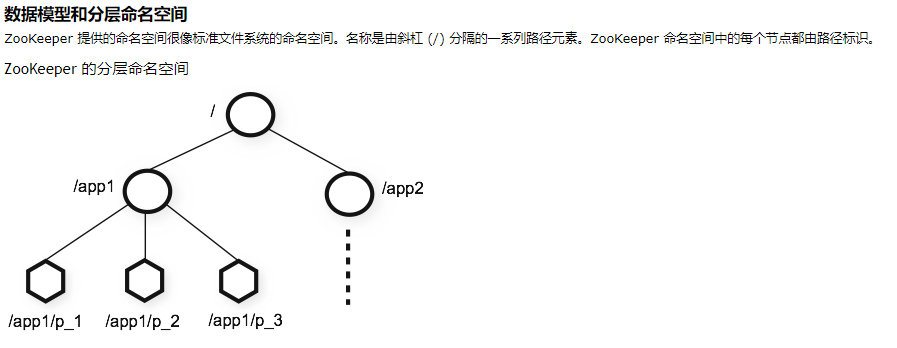
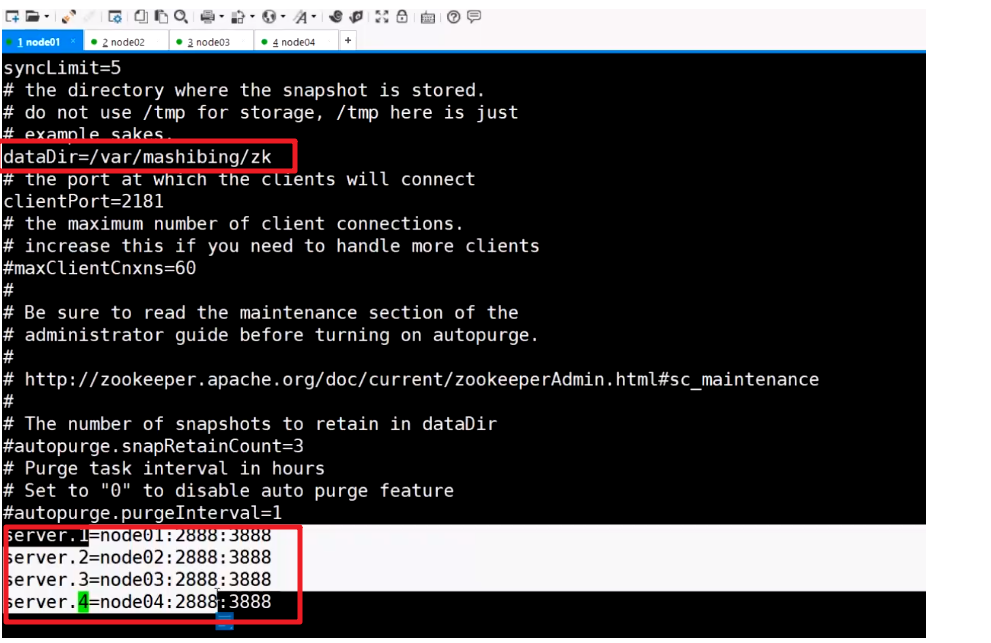
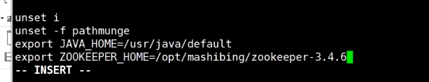
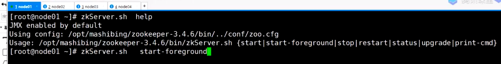
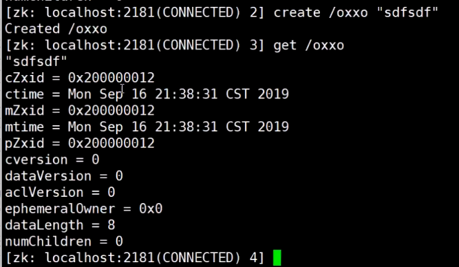
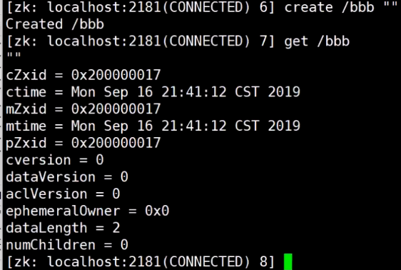
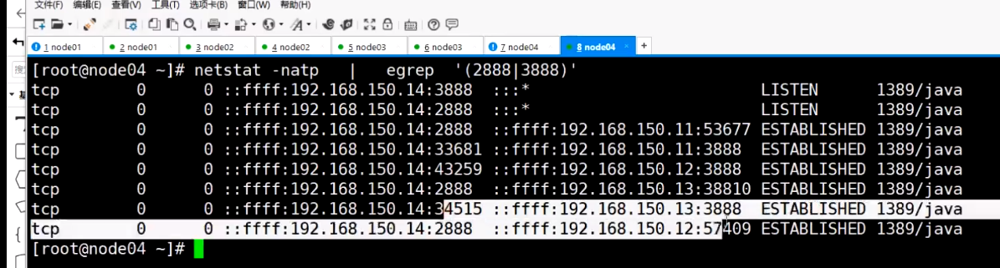

Zookeeper:分布式协调服务

参考：https://www.cnblogs.com/ysocean/p/9860529.html#_label4

zookeeper官方文档：http://zookeeper.apache.org/doc/r3.7.0/zookeeperOver.html



zookeeper有2种运行状态：

1.可用状态

2.不可用状态：leader挂了，无主模式

不可用状态恢复到可用状态应该越快越好，从无主模式恢复可用状态不超过200ms

zookeeper不适合用作数据库，每个节点可以存储1M数据


每个客户端连接zookeeper都在zookeeper建立一个session

分布式锁：zookeeper是通过session来维护分布式锁，当客户端连接时会为客户端创建一个临时节点，用来保存session，如果客户端挂了，则session会被销毁，分布式锁自动释放了


zookeeper保证顺序一致性：在主从模型下，所有的写请求会被发送到leader上，zookeeper会对写请求进行排队操作

### 保证

ZooKeeper 非常快速且非常简单。但是，由于它的目标是成为构建更复杂服务（例如同步）的基础，因此它提供了一组保证。这些都是：

- 顺序一致性 - 来自客户端的更新将按发送顺序应用。
- 原子性 - 更新要么成功要么失败。没有部分结果。
- 单一系统映像 - 无论连接到哪个服务器，客户端都将看到相同的服务视图。即，即使客户端故障转移到具有相同会话的不同服务器，客户端也永远不会看到系统的旧视图。
- 可靠性 - 应用更新后，它将从那时起一直存在，直到客户端覆盖更新。
- 及时性 - 系统的客户视图保证在特定时间范围内是最新的。

##### 为什么zookeeper节点是奇数？

我们知道，在每台机器数据保持一致的情况下，zookeeper集群可以保证，客户端发起的每次查询操作，集群节点都能返回同样的结果。

　　但是对于客户端发起的修改、删除等能改变数据的操作呢？集群中那么多台机器，你修改你的，我修改我的，最后返回集群中哪台机器的数据呢？

　　这就是一盘散沙，需要一个领导，于是在zookeeper集群中，leader的作用就体现出来了，只有leader节点才有权利发起修改数据的操作，而follower节点即使接收到了客户端发起的修改操作，也要将其转交给leader来处理，leader接收到修改数据的请求后，会向所有follower广播一条消息，让他们执行某项操作，follower 执行完后，便会向 leader 回复执行完毕。当 leader 收到半数以上的 follower 的确认消息，便会判定该操作执行完毕，然后向所有 follower 广播该操作已经生效。

　　所以zookeeper集群中leader是不可缺少的，但是 leader 节点是怎么产生的呢？其实就是由所有follower 节点选举产生的，讲究民主嘛，而且leader节点只能有一个，毕竟一个国家不能有多个总统。

　　这个时候回到我们的小标题，为什么 zookeeper 节点数是奇数，我们下面来一一来说明：

　　**①、容错率**

　　首先从容错率来说明：（需要保证集群能够有半数进行投票）

　　2台服务器，至少2台正常运行才行（2的半数为1，半数以上最少为2），正常运行1台服务器都不允许挂掉，但是相对于 单节点服务器，2台服务器还有两个单点故障，所以直接排除了。

　　3台服务器，至少2台正常运行才行（3的半数为1.5，半数以上最少为2），正常运行可以允许1台服务器挂掉

　　4台服务器，至少3台正常运行才行（4的半数为2，半数以上最少为3），正常运行可以允许1台服务器挂掉

　　5台服务器，至少3台正常运行才行（5的半数为2.5，半数以上最少为3），正常运行可以允许2台服务器挂掉

　　**②、防脑裂**

　　脑裂集群的脑裂通常是发生在节点之间通信不可达的情况下，集群会分裂成不同的小集群，小集群各自选出自己的leader节点，导致原有的集群出现多个leader节点的情况，这就是脑裂。

　　3台服务器，投票选举半数为1.5，一台服务裂开，和另外两台服务器无法通行，这时候2台服务器的集群（2票大于半数1.5票），所以可以选举出leader，而 1 台服务器的集群无法选举。

　　4台服务器，投票选举半数为2，可以分成 1,3两个集群或者2,2两个集群，对于 1,3集群，3集群可以选举；对于2,2集群，则不能选择，造成没有leader节点。

　　5台服务器，投票选举半数为2.5，可以分成1,4两个集群，或者2,3两集群，这两个集群分别都只能选举一个集群，满足zookeeper集群搭建数目。

　　以上分析，我们从容错率以及防止脑裂两方面说明了3台服务器是搭建集群的最少数目，4台发生脑裂时会造成没有leader节点的错误。

#### 安装

下载地址：http://mirror.bit.edu.cn/apache/zookeeper/zookeeper-3.5.9/

准备4台虚拟机，安装java1.7以上

解压：


修改配置文件名称：mv zoo_sample.cfg zoo.cfg


修改配置 zoo.cfg：

maxClientCnxns = 60允许的最大客户端连接数

server.1=node01:2888:3888 配置集群的server，第一次启动或者leader挂掉之后集群内通过3888通信选出一个leader，选出leader后后续的维护节点信息是通过2888端口进行的



```
上面红色框住的内容即是我们修改的内容：
　　①、tickTime：基本事件单元，这个时间是作为Zookeeper服务器之间或客户端与服务器之间维持心跳的时间间隔，每隔tickTime时间就会发送一个心跳；最小 的session过期时间为2倍tickTime
　　②、dataDir：存储内存中数据库快照的位置，除非另有说明，否则指向数据库更新的事务日志。注意：应该谨慎的选择日志存放的位置，使用专用的日志存储设备能够大大提高系统的性能，如果将日志存储在比较繁忙的存储设备上，那么将会很大程度上影像系统性能。
　　③、client：监听客户端连接的端口。
　　④、initLimit：允许follower连接并同步到Leader的初始化连接时间，以tickTime为单位。当初始化连接时间超过该值，则表示连接失败。
　　⑤、syncLimit：表示Leader与Follower之间发送消息时，请求和应答时间长度。如果follower在设置时间内不能与leader通信，那么此follower将会被丢弃。
　　⑥、server.A=B:C:D
　　　　A：其中 A 是一个数字，表示这个是服务器的编号；
　　　　B：是这个服务器的 ip 地址；
　　　　C：Zookeeper服务器之间的通信端口；
　　　　D：Leader选举的端口。
　　我们需要修改的第一个是 dataDir ,在指定的位置处创建好目录。
　　第二个需要新增的是 server.A=B:C:D 配置，其中 A 对应下面我们即将介绍的myid 文件。B是集群的各个IP地址，C:D 是端口配置。
```


将zookeeper整个目录远程拷贝至61,62,63机器

```
scp -r zookeeper-3.4.6 root@192.168.25.61:/soft
scp -r zookeeper-3.4.6 root@192.168.25.62:/soft
scp -r zookeeper-3.4.6 root@192.168.25.63:/soft
```

##### 创建 myid 文件

创建多级目录：mkdir -p /var/mashibing/zk ，在目录下创建文件myid，内容为id(1)。


第二台机器依次类推，


远程拷贝内容至node3和node4：

```
[root@centos7 var]# scp -r ./mashibing root@192.168.25.61:/var
[root@centos7 var]# scp -r ./mashibing root@192.168.25.62:/var
[root@centos7 var]# scp -r ./mashibing root@192.168.25.63:/var
分别修改60，61,62,63机器的myid为1，2,3,4
```


将zookeeper加入环境变量中， vi /etc/profile

```
vi /etc/profile
export ZOOKEEPER_HOME=/soft/zookeeper-3.4.6
export PATH=$PATH:$ZOOKEEPER_HOME/bin
source  /etc/profile
```




source  /etc/profile刷新配置文件

启动zookeeper，使用start-foreground表示前台启动

```
分别在4台机器上启动zookeeper服务
zkServer.sh start-foreground

#192.168.25.60
[root@centos7 ~]# zkServer.sh status
JMX enabled by default
Using config: /soft/zookeeper-3.4.6/bin/../conf/zoo.cfg
Mode: follower

#192.168.25.61
[root@centos7 ~]# zkServer.sh status
JMX enabled by default
Using config: /soft/zookeeper-3.4.6/bin/../conf/zoo.cfg
Mode: follower

# 192.168.25.62
[root@centos7 ~]# zkServer.sh status
JMX enabled by default
Using config: /soft/zookeeper-3.4.6/bin/../conf/zoo.cfg
Mode: leader
```



查看启动状态：


查看日志，follower向leader获取快照，保证数据最终一致性：


停止node3，查看leader是否重新选举，发现node4已经成为新的leader

启动zk客户端，默认连接的是本机：


客户端输入quit退出后，session关闭


客户端连接后，会创建一个sessionId


创建节点：

```
[zk: localhost:2181(CONNECTED) 0] ls /
[ooxx, zookeeper]
[zk: localhost:2181(CONNECTED) 1] create /ooxx/xxoo ""
Created /ooxx/xxoo
[zk: localhost:2181(CONNECTED) 2] ls /
[ooxx, zookeeper]
[zk: localhost:2181(CONNECTED) 3] ls /ooxx
[xxoo]
```


set存放数据，数据最多存放1M

```
[zk: localhost:2181(CONNECTED) 5] set /ooxx "hello"
[zk: localhost:2181(CONNECTED) 6] get /ooxx
hello
Command not found: Command not found help
[zk: localhost:2181(CONNECTED) 9] get -s /ooxx
hello
cZxid = 0x300000002
ctime = Sun Aug 01 03:39:56 CST 2021
mZxid = 0x400000005
mtime = Sun Aug 01 03:45:13 CST 2021
pZxid = 0x400000003
cversion = 1
dataVersion = 2
aclVersion = 0
ephemeralOwner = 0x0
dataLength = 5
numChildren = 1
```


ephemeralOwner=0x0  临时节点

create -e 创建临时节点，临时节点当session销毁时会被删除

```
在一个节点上创建临时节点：
[zk: localhost:2181(CONNECTED) 2] create -e /haha
Created /haha
然后在另一个节点上可以看到创建的临时节点
[zk: localhost:2181(CONNECTED) 10] ls /
[haha, ooxx, zookeeper]
退出客户端，发现临时节点被销毁
[zk: localhost:2181(CONNECTED) 11] ls /
[ooxx, zookeeper]
#删除节点
[zk: localhost:2181(CONNECTED) 16] deleteall /sdfsdfsfaaaaaaaaaa
Node does not exist: /sdfsdfsfaaaaaaaaaa
```


* 当一个客户端连接到zookeeper，zookeeper会为客户端创建一个session，并且把session同步集群内的其他机器，每创建一个session会消耗一个cZxid(事务id)，事务id是顺序递增的，因此事务id越小越先发生。


再启动一个客户端，


继续在之前的机器上创建一个节点，发生事务id和上一次创建节点的事务id中间相差了1，由此证明创建session会消耗事务id，session退出也会消耗一个事务id



退出node02的客户端，统一全局视图，删除session会消耗一个事务id


分别在node01和node02上启动两个客户端

然后继续在node04上创建一个节点，



在分布式情况下，创建节点是可能发生覆盖的，创建节点时加上-s参数，zookeeper会在节点后加上一串数字，数字是顺序递增的，可以避免重复这个问题

```
[zk: localhost:2181(CONNECTED) 1] create -s /abc ""
Created /abc0000000004
```


zookeeper特点：

1. 统一配置管理：node可以存储1M数据

2. 分组管理：path结构

3. 统一命名： sequential

4. 分布式同步-<临时节点

应用：

1. 分布式锁：通过临时节点实现，锁依托一个父节点且具备父节点下可以有多把锁(队列式事务的锁)
2. HA选主节点，抢到分布式锁的节点为主节点

```shell
操作：

1. 准备node01-node04

2. 安装jdk，并设置javahome

3. tar zxvf zookeeper*.tar.gz

4. mkdir /opt/mashibing

5. mv zookeeper /opt/mashibing

6. vi /etc/profile

7. export ZOOKEEPER_HOME=/opt/mashibing/zookeeper-3.4.6

   export PATH=$PATH:#ZOOKEEPER_HOME/bin

8. cd zookeeper/conf

9. cp zoo.sem*.cfg zoo.cfg

10.  vi zoo.cfg

     dataDir=

     server.1=node01:2888:3888

11. mkdir -p /var/mashibing/zk

12. echo 1>/var/mashibing/zk/myid

13. cd /opt && scp -r ./mashibing/ node02: 'pwd'

14. node02-node04 创建myid

15. 启动顺序 1,2，3,4

16. zkserver.sh start-foreground

17.  zkCli.sh

     help

    ls /

    create /ooxx ""

    create -s /abc/aaa

    create -e /ooxx/xxoo

    crreate -s -e /ooxx/xoxo

    get /ooxx
```

egrep:使用正则表达式




3888: 选主投票用的

2888: leader接受write请求

```
[root@node03 ~]# netstat -natp | egrep '(2888|3888)'
tcp6       0      0 192.168.25.62:3888      :::*                    LISTEN      2978/java           
tcp6       0      0 192.168.25.62:44502     192.168.25.61:2888      ESTABLISHED 2978/java           
tcp6       0      0 192.168.25.62:36138     192.168.25.61:3888      ESTABLISHED 2978/java           
tcp6       0      0 192.168.25.62:35728     192.168.25.60:3888      ESTABLISHED 2978/java   
[root@node02 ~]# netstat -natp | egrep '(2888|3888)'
tcp6       0      0 192.168.25.61:2888      :::*                    LISTEN      3383/java           
tcp6       0      0 192.168.25.61:3888      :::*                    LISTEN      3383/java           
tcp6       0      0 192.168.25.61:2888      192.168.25.62:44502     ESTABLISHED 3383/java           
tcp6       0      0 192.168.25.61:2888      192.168.25.60:51634     ESTABLISHED 3383/java           
tcp6       0      0 192.168.25.61:50036     192.168.25.60:3888      ESTABLISHED 3383/java           
tcp6       0      0 192.168.25.61:3888      192.168.25.62:36138     ESTABLISHED 3383/java   
[root@node01 ~]# netstat -natp | egrep '(2888|3888)'
tcp6       0      0 192.168.25.60:3888      :::*                    LISTEN      3963/java           
tcp6       0      0 192.168.25.60:3888      192.168.25.62:35728     ESTABLISHED 3963/java           
tcp6       0      0 192.168.25.60:3888      192.168.25.61:50036     ESTABLISHED 3963/java           
tcp6       0      0 192.168.25.60:51634     192.168.25.61:2888      ESTABLISHED 3963/java    
```


