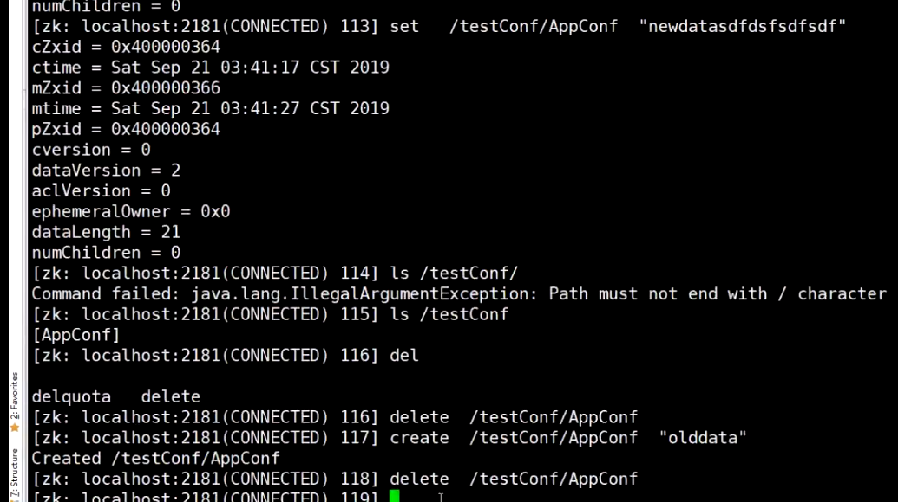
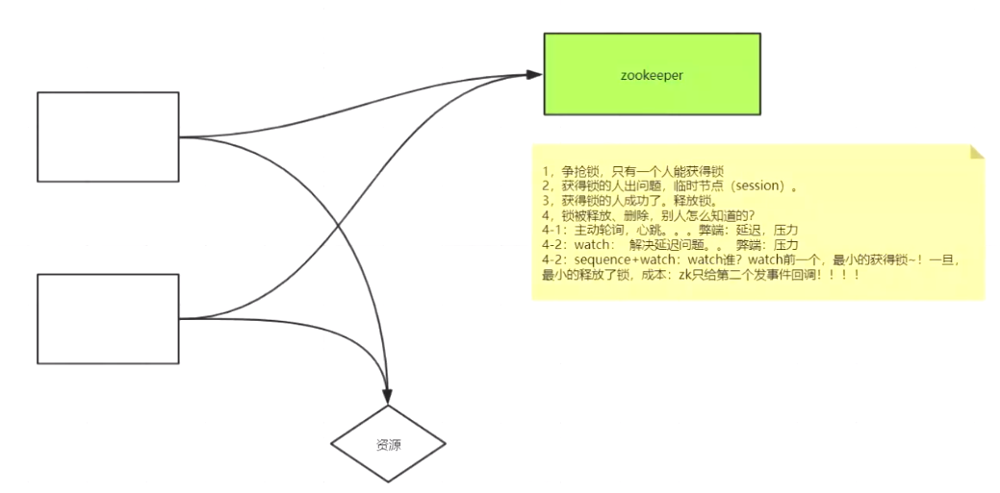

##### 分布式配置



##### 注册发现

代码：实现对一个节点的监控，获取该节点最新的配置

```
[zk: localhost:2181(CONNECTED) 43] set /testConfig/AppConf "haha"
[zk: localhost:2181(CONNECTED) 44] set /testConfig/AppConf "heihei"
[zk: localhost:2181(CONNECTED) 45] set /testConfig/AppConf "haha"
[zk: localhost:2181(CONNECTED) 46] set /testConfig/AppConf "haha"
[zk: localhost:2181(CONNECTED) 47] deleteall /testConfig/AppConf
[zk: localhost:2181(CONNECTED) 48] create /testConfig/AppConf "hello"
Created /testConfig/AppConf
```

##### 分布式锁

 ```
 deleteall /testLock
 create /testLock ""
 ls /testLock
 ```




##### ractive模式编程

